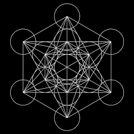

# Introduction to the 5 Platonic solids

Platonic solids are a special class of highly symmetric three-dimensional geometric objects. They are named after the Greek philosopher Plato, who discussed them in his work *Timaeus* and associated them with the classical elements of nature. However, the mathematical study of these solids predates Plato and was known to earlier Greek mathematicians.

A Platonic solid is a **regular convex polyhedron** satisfying the following conditions:

- All faces are congruent regular polygons.
- The same number of faces meet at every vertex.
- All edges are equal in length.
- All vertices are geometrically identical.

Because of these strict conditions, only **five** Platonic solids exist.

| Platonic Solid | Faces | Face Type | Vertices | Edges | Hamiltonian | Eulerian |
|-----------|-----------|-----------|-----------|-----------|-----------|-----------|
| Tetrahedron | 4 | Equilateral Triangle | 4 | 6 | Yes | No |
| Cube (Hexahedron) | 6 | Square | 8 | 12 | Yes | No |
| Octahedron | 8 | Equilateral Triangle | 6 | 12 | Yes | Yes |
| Dodecahedron | 12 | Regular Pentagon | 20 | 30 | Yes | No |
| Icosahedron | 20 | Equilateral Triangle | 12 | 30 | Yes | No |

The existence of only five Platonic solids can be understood through geometric constraints. At each vertex, the sum of the face angles meeting there must be **less than** $(360^\circ)$; otherwise, the shape would lie flat and fail to form a three-dimensional solid. This restriction allows only a limited number of regular polygons to combine in space, resulting in exactly five possible solids.

The Platonic solids possess remarkable symmetry and play an important role in geometry, topology, crystallography, architecture, chemistry, and mathematical modelling. Several important mathematical concepts such as duality, symmetry groups, Euler’s formula, and polyhedral geometry can be explored through their study.

These solids are closely related through the concept of **duality**. The tetrahedron is self-dual, while the cube and octahedron form a dual pair, as do the dodecahedron and icosahedron.

The study of Platonic solids provides a foundation for understanding regular polyhedra and offers insight into the deep relationship between symmetry, geometry, and spatial structure.

## Historical Perspective

The Platonic solids occupy a unique place in the history of mathematics. They are the only five convex polyhedra in which every face is the same regular polygon and the same number of faces meet at every vertex. Beyond their geometric definition, they have played a profound role in the development of mathematical thought, philosophy, and early attempts to understand the structure of the physical world.

What makes these shapes historically significant is not merely their mathematical rarity, but the way ancient thinkers interpreted them. To the Greek philosophers, geometry was not an abstract discipline detached from reality; it was the language through which the universe expressed order and harmony. The Platonic solids were therefore seen not just as shapes, but as fundamental building blocks of nature itself.

### Early Geometric Thought and the Pythagorean Influence

The origins of interest in regular solids can be traced back to the Pythagorean school around the 5th century BCE. The Pythagoreans believed that numbers and geometric relationships governed the structure of reality. Their studies were deeply intertwined with mysticism and philosophy, and they considered geometric perfection to reflect cosmic order.

During this period, certain regular solids such as the cube and tetrahedron were already known. However, they were not yet understood as part of a complete classification. Instead, they were treated as isolated objects with aesthetic and symbolic significance.

The Pythagorean worldview set the stage for a deeper investigation: if symmetry and regularity are fundamental principles of nature, then how many perfectly symmetric three-dimensional forms can exist?

### Theaetetus and the Classification of the Five Solids

A major turning point in the history of Platonic solids came with the work of Theaetetus, a mathematician associated with Plato’s Academy in the 4th century BCE. He is credited with the first systematic study and classification of all convex regular polyhedra.

The key mathematical achievement attributed to Theaetetus is the proof that there are exactly five such solids. This is not an obvious fact; it arises from strict geometric constraints. A regular polyhedron must have: - identical regular polygonal faces, - identical vertices, - and enough angular deficit at each vertex to allow the shape to close in three dimensions.

These constraints severely limit the possibilities. The result is striking: only five configurations satisfy all conditions simultaneously. This classification transformed the Platonic solids from a set of known shapes into a complete mathematical system.

### Plato’s Philosophical Interpretation

Although Plato was not the discoverer of these solids, his philosophical influence is the reason they became historically prominent. In his dialogue *Timaeus*, Plato proposed a cosmological framework in which the physical world is composed of four classical elements: earth, water, air, and fire, along with a fifth element representing the heavens or cosmos.

He associated each of the four elements with a Platonic solid based on perceived geometric and physical properties:

- The tetrahedron, with its sharp edges and pointed structure, was associated with fire.
- The cube, stable and evenly balanced, was associated with earth.
- The octahedron, relatively symmetrical and less “grounded,” was associated with air.
- The icosahedron, with its many faces and smooth appearance, was associated with water.
- The dodecahedron, the most complex and least intuitively tangible, was associated with the structure of the universe itself.

These associations were not arbitrary aesthetic choices. They reflect an early attempt to connect geometric structure with physical intuition. Sharpness, stability, fluidity, and symmetry were interpreted as geometric expressions of natural behavior.

### Euclid and the Mathematical Formalization

The Platonic solids were later rigorously treated by Euclid in *Elements*, one of the most influential mathematical texts in history. Euclid provided formal geometric constructions and proofs that established these solids within a deductive system.

Where earlier interpretations were philosophical or intuitive, Euclid’s approach was strictly logical. He demonstrated how each solid could be constructed from fundamental geometric principles and confirmed that no other regular convex polyhedra exist.

This marked an important transition in the history of mathematics: from geometric intuition rooted in philosophy to a formal axiomatic system.

### Kepler and the Platonic Model of Planetary Orbits

The influence of Platonic solids did not end in antiquity. During the Renaissance, the German astronomer Johannes Kepler attempted to revive the idea that geometry lies at the foundation of the physical universe, extending it from elemental theory to planetary motion.

In his early work *Mysterium Cosmographicum* (1596), Kepler proposed a striking model of the solar system in which the spacing between the known planetary orbits was determined by nesting the five Platonic solids inside one another. Each solid was placed between two planetary spheres, with the idea that the ratios of orbital radii could be explained through this geometric arrangement.

In this model, the sequence of solids was used to account for the six known planets at the time (Mercury through Saturn). Although the model was elegant and deeply influenced by the Platonic tradition of mathematical harmony, it was ultimately based on idealized assumptions rather than precise observational data.

Kepler’s work is important not because it was correct, but because it represented a transition in scientific thinking. It marked an attempt to move from philosophical geometry—where shapes were assumed to dictate nature—to mathematical physics, where geometric models had to be tested against empirical measurements.

Later in his career, Kepler abandoned the Platonic solid model after analyzing the precise astronomical observations of Tycho Brahe. This led him instead to the discovery that planetary orbits are elliptical, not circular, and governed by three fundamental laws of planetary motion. These laws became a cornerstone of classical mechanics.

Despite being replaced, Kepler’s early model remains historically significant. It reflects one of the last major attempts to unify cosmic structure with Platonic geometry, showing how deeply the idea of symmetry influenced early scientific thought.

### Why Only Five Solids Exist

The limitation to five Platonic solids arises from a fundamental geometric constraint involving angles at a vertex. For a shape to exist in three dimensions, the sum of the angles meeting at each vertex must be less than 360 degrees; otherwise, the structure would flatten.

Only a small number of regular polygon combinations satisfy this condition. Triangles, squares, and pentagons are the only regular polygons that can form such closed structures in a consistent way. When combined under the requirement of identical vertices and faces, the possibilities reduce precisely to five distinct solids.

This fact highlights a deeper principle: symmetry in higher dimensions is heavily constrained, and only a few perfect structures can exist.

#### Proof using Shlafli symbol

A Platonic solid is represented by the Schläfli symbol:

$$\{p, q\}$$

where: - $p$ = number of sides of each face\
- $q$ = number of faces meeting at each vertex

Each regular $p$-gon has interior angle:

$$\alpha = \left(1 - \frac{2}{p}\right)\pi$$

At each vertex, $q$ such angles meet. For the solid to exist in 3D space, the sum must be less than $2\pi$:

$$q \left(1 - \frac{2}{p}\right)\pi < 2\pi$$

Divide by $\pi$:

$$q \left(1 - \frac{2}{p}\right) < 2$$

Rewriting:

$$q \frac{p - 2}{p} < 2$$

Multiply by $p$:

$$q(p - 2) < 2p$$

Rearrange:

$$(p - 2)(q - 2) < 4$$

We now search integers $p \ge 3$, $q \ge 3$ satisfying:

$$(p - 2)(q - 2) < 4$$

Checking cases:

- $p = 3 \Rightarrow q = 3,4,5$
- $p = 4 \Rightarrow q = 3$
- $p = 5 \Rightarrow q = 3$
- $p \ge 6 \Rightarrow$ no solutions

Thus we obtain exactly five possibilities:

$$\{3,3\}, \{3,4\}, \{4,3\}, \{3,5\}, \{5,3\}$$

#### Proof using Euler's formula

Let: - $V$ = vertices\
- $E$ = edges\
- $F$ = faces

Euler’s formula:

$$V - E + F = 2$$

Assume: - each face is a regular $p$-gon\
- $q$ faces meet at each vertex

Counting edges:

$$pF = 2E$$

$$qV = 2E$$

So:

$$V = \frac{2E}{q}, \quad F = \frac{2E}{p}$$

Substitute into Euler’s formula:

$$\frac{2E}{q} - E + \frac{2E}{p} = 2$$

Divide by $E$:

$$\frac{2}{q} - 1 + \frac{2}{p} = \frac{2}{E}$$

Since $E > 0$, the left side must be positive:

$$\frac{1}{p} + \frac{1}{q} > \frac{1}{2}$$

Test $p, q \ge 3$:

- $p = 3 \Rightarrow q = 3,4,5$
- $p = 4 \Rightarrow q = 3$
- $p = 5 \Rightarrow q = 3$
- $p \ge 6 \Rightarrow$ no solutions

Again we obtain:

$$\{3,3\}, \{3,4\}, \{4,3\}, \{3,5\}, \{5,3\}$$

| Solid        | Schläfli symbol |
|--------------|-----------------|
| Tetrahedron  | {3,3}           |
| Cube         | {4,3}           |
| Octahedron   | {3,4}           |
| Dodecahedron | {5,3}           |
| Icosahedron  | {3,5}           |

### Metatron’s Cube and Its Connection to Platonic Solids

{fig-align="center" width="60%"}

Metatron’s Cube is a geometric figure that emerged much later than the classical study of Platonic solids, within traditions of sacred geometry that developed in the medieval and early modern periods. Although it is not part of Greek mathematics, it is deeply influenced by the same idea that symmetry is the foundation of structure in nature.

The construction of Metatron’s Cube begins with a pattern of evenly spaced circles arranged in a hexagonal lattice. This arrangement creates a highly regular field of intersection points. When the centers of these circles are identified and connected by straight lines, a complex network of vertices and edges is formed. This resulting structure is what is referred to as Metatron’s Cube.

What makes this figure significant is not the circles themselves, but the symmetry they enforce on the resulting network. The arrangement produces a dense system of equal-length connections and repeated angular relationships. Within this system, one can observe multiple embedded configurations that mirror the adjacency patterns of the Platonic solids.

The connection to Platonic solids arises from the fact that these solids are themselves complete symmetry objects in three dimensions. Each Platonic solid corresponds to a distinct symmetry group, and together they exhaust all possible regular convex polyhedra. Metatron’s Cube, when viewed as a two-dimensional projection of a highly symmetric structure, encodes these same symmetry constraints in a flattened form. Specific selections of vertices within the figure can reproduce the connectivity patterns of the tetrahedron, cube, octahedron, icosahedron, and dodecahedron.

From this perspective, the relationship is not one of literal containment, but of shared structure. The Platonic solids exist as three-dimensional realizations of symmetry, while Metatron’s Cube represents a planar manifestation of a similarly constrained system. Both reflect the same underlying principle: that only a limited number of perfectly regular forms can exist under strict symmetry conditions.

Symbolically, Metatron’s Cube has been interpreted as a unifying diagram of geometric order. It is often associated with the idea that all structured forms in nature can be derived from a single underlying pattern of symmetry. In this interpretation, the Platonic solids represent stable three-dimensional outcomes of that pattern, while Metatron’s Cube represents the relational framework from which such outcomes can be conceptually reconstructed.

Thus, rather than being a literal container of Platonic solids, Metatron’s Cube functions as a symbolic map of symmetry itself, linking simple geometric repetition to the emergence of highly regular spatial forms.

### Sacred Geometry

Sacred geometry is not a formal branch of mathematics, but rather a historical and philosophical way of interpreting geometric patterns as expressions of order in nature. At its core, it refers to the belief that certain shapes and proportions—especially those with high symmetry—are fundamentally connected to the structure of the physical world and, in some traditions, to human perception of beauty and harmony.

Although the term “sacred” suggests a mystical origin, the underlying content is deeply mathematical. Sacred geometry is primarily concerned with patterns such as circles, triangles, spirals, and polyhedra, and with the relationships between them. Many of these shapes appear repeatedly in both natural systems and mathematical constructions, which is why they have been historically regarded as meaningful.

From a modern perspective, what sacred geometry attempts to capture can often be explained through symmetry, scaling laws, and optimization principles. For example, the hexagonal pattern seen in honeycombs arises because it efficiently fills space while minimizing material usage. Similarly, spiral patterns appear in galaxies, shells, and plants due to growth processes governed by simple iterative rules.

In this sense, sacred geometry can be interpreted as an early attempt to recognize that nature is not random, but structured by consistent mathematical principles. Before the development of formal physics and biology, geometric forms were one of the few available tools for describing this hidden order.

The human connection to these patterns is also significant. Our visual system is highly sensitive to symmetry, repetition, and proportional relationships. This is why shapes associated with sacred geometry—such as circles, stars, and Platonic solids—often feel aesthetically “balanced” or harmonious. The perception of beauty in these forms is not arbitrary; it is closely linked to how the brain processes structure and regularity.

Thus, sacred geometry can be understood in two complementary ways. Historically, it reflects the attempt to explain nature through ideal forms. Scientifically, it corresponds to the study of symmetry and pattern formation in physical systems. In both cases, it highlights a central idea: that complex structures in nature often arise from simple and repeated geometric rules.

## Tetrahedron

```{python}
#| echo: false
#| warning: false
#| message: false

import numpy as np
import plotly.graph_objects as go

# ============================================================
# TETRAHEDRON (Quarto-safe: Step 1–3)
# ============================================================

A = np.array([1, 1, 1])
B = np.array([-1, -1, 1])
C = np.array([-1, 1, -1])
D = np.array([1, -1, -1])

vertices = np.array([A, B, C, D])
labels = ['A', 'B', 'C', 'D']

center = np.mean(vertices, axis=0)

# ============================================================
# FACES
# ============================================================

faces = np.array([
    [0,1,2],
    [0,1,3],
    [0,2,3],
    [1,2,3]
])

# ============================================================
# EDGES
# ============================================================

edges = [
    (0,1),
    (0,2),
    (0,3),
    (1,2),
    (1,3),
    (2,3)
]

# ============================================================
# GEOMETRY
# ============================================================

edge_length = np.linalg.norm(A - B)

circumradius = edge_length * np.sqrt(6) / 4
inradius = edge_length * np.sqrt(6) / 12
midradius = edge_length * np.sqrt(2) / 4

# ============================================================
# HELPERS
# ============================================================

def midpoint(a, b):
    return (a + b) / 2

# ============================================================
# FIGURE
# ============================================================

fig = go.Figure()

# ============================================================
# SURFACE
# ============================================================

fig.add_trace(go.Mesh3d(
    x=vertices[:,0],
    y=vertices[:,1],
    z=vertices[:,2],

    i=faces[:,0],
    j=faces[:,1],
    k=faces[:,2],

    opacity=0.22,
    name='Tetrahedron'
))

# ============================================================
# EDGES
# ============================================================

for e1, e2 in edges:

    p1 = vertices[e1]
    p2 = vertices[e2]

    fig.add_trace(go.Scatter3d(
        x=[p1[0], p2[0]],
        y=[p1[1], p2[1]],
        z=[p1[2], p2[2]],

        mode='lines',
        line=dict(width=5),

        showlegend=False
    ))

# ============================================================
# VERTICES
# ============================================================

fig.add_trace(go.Scatter3d(
    x=vertices[:,0],
    y=vertices[:,1],
    z=vertices[:,2],

    mode='markers+text',
    text=labels,
    textposition='top center',

    marker=dict(size=5),

    name='Vertices'
))

# ============================================================
# CENTER O
# ============================================================

fig.add_trace(go.Scatter3d(
    x=[center[0]],
    y=[center[1]],
    z=[center[2]],

    mode='markers+text',
    text=['O'],
    textposition='bottom center',

    marker=dict(size=7),

    name='Center'
))

# ============================================================
# RADII
# ============================================================

# Circumradius R
v = A

fig.add_trace(go.Scatter3d(
    x=[center[0], v[0]],
    y=[center[1], v[1]],
    z=[center[2], v[2]],

    mode='lines',
    line=dict(width=6),

    name='Circumradius R'
))

midR = midpoint(center, v)

fig.add_trace(go.Scatter3d(
    x=[midR[0]],
    y=[midR[1]],
    z=[midR[2]],

    mode='text',
    text=['R'],

    showlegend=False
))

# Inradius r
face_center = np.mean([B, C, D], axis=0)

fig.add_trace(go.Scatter3d(
    x=[center[0], face_center[0]],
    y=[center[1], face_center[1]],
    z=[center[2], face_center[2]],

    mode='lines',
    line=dict(width=6, dash='dot'),

    name='Inradius r'
))

midr = midpoint(center, face_center)

fig.add_trace(go.Scatter3d(
    x=[midr[0]],
    y=[midr[1]],
    z=[midr[2]],

    mode='text',
    text=['r'],

    showlegend=False
))

# Midradius ρ
edge_mid = midpoint(A, B)

fig.add_trace(go.Scatter3d(
    x=[center[0], edge_mid[0]],
    y=[center[1], edge_mid[1]],
    z=[center[2], edge_mid[2]],

    mode='lines',
    line=dict(width=6, dash='dash'),

    name='Midradius ρ'
))

midrho = midpoint(center, edge_mid)

fig.add_trace(go.Scatter3d(
    x=[midrho[0]],
    y=[midrho[1]],
    z=[midrho[2]],

    mode='text',
    text=['ρ'],

    showlegend=False
))

# ============================================================
# LAYOUT
# ============================================================

fig.update_layout(
    title='Interactive Tetrahedron',

    height=800,

    scene=dict(
        aspectmode='cube'
    )
)

fig
```

### Geometric Properties

Let the edge length be $a$.

| Property            | Formula / Value                                   |
|---------------------|---------------------------------------------------|
| Faces               | $4$                                               |
| Edges               | $6$                                               |
| Vertices            | $4$                                               |
| Face Type           | Equilateral Triangle                              |
| Face Interior Angle | $60^\circ$                                        |
| Dihedral Angle      | $\cos^{-1}\left(\frac13\right)\approx70.53^\circ$ |
| Surface Area        | $\sqrt{3}a^2$                                     |
| Volume              | $\frac{\sqrt2}{12}a^3$                            |
| Height              | $\sqrt{\frac23}a$                                 |
| Inradius ($r$)      | $\frac{\sqrt6}{12}a$                              |
| Circumradius ($R$)  | $\frac{\sqrt6}{4}a$                               |
| Midradius ($\rho$)  | $\frac{\sqrt2}{4}a$                               |

### Spectral Properties

```{python}
#| echo: false
#| warning: false
#| message: false

from IPython.display import display, Math
import numpy as np

A = np.array([
    [0,1,1,1],
    [1,0,1,1],
    [1,1,0,1],
    [1,1,1,0]
])

L = 3*np.eye(4, dtype=int) - A

# Matrix display function
def show_matrix(M, name):
    rows = [" & ".join(map(str, row)) for row in M]
    latex = r"\\ ".join(rows)
    display(Math(
        rf"{name}=\begin{{bmatrix}}{latex}\end{{bmatrix}}"
    ))

display(Math(r"\textbf{Adjacency Matrix}"))
show_matrix(A, "A")

display(Math(
    r"\operatorname{Spec}(A)=\{(3)^1, (-1)^3\}"
))

display(Math(r"\textbf{Laplacian Matrix}"))
show_matrix(L, "L")

display(Math(
    r"\operatorname{Spec}(L)=\{(4)^3, (0)^1\}"
))

display(Math(
    r"\textbf{Singular Values of Incidence Matrix}"
))

display(Math(
    r"\sigma(Q)=\{(2)^3, (0)^1\}"
))
```

### Symmetry and Automorphisms

For Platonic solids, the total number of geometric symmetries of the solid is equal to the total number of automorphisms of its associated graph. In other words, every graph automorphism corresponds to a geometric symmetry, and every geometric symmetry induces a graph automorphism.

$|Sym(Solid)| = |Aut(G)|$

The total number of symmetries is calculated by counting all distinct rotations and reflections about the axes of symmetry passing through vertices, edges, and faces of the solid. These symmetries together form the symmetry group of the Platonic solid.

To count:

Identity = 1

Vertex to centre of opposite face -\> 4 axes and each face is a triangle -\> 2 rotations per axis $(120^\circ,240^\circ) = 4 \times 2$ = 8

Edge to opposite edge -\> 3 axes and total rotations per axis -\> 1 $(180^\circ) = 3 \times 1$ = 3

Total rotations = 1+8+3 = 12

$|Rot(Tetrahedron)| = 12$

All rotational symmetries of the tetrahedron correspond to even permutations of the 4 vertices.

$Rot(Tetrahedron) \cong A_{4}$

Total reflections = Total rotations = 12

Total symmetries = total rotations + total reflections = 12+12 = 24

$|Sym(Tetrahedron)| = 24$

$Sym(Tetrahedron) \cong S_{4}$

## Cube

```{python}
#| echo: false
#| warning: false
#| message: false

import numpy as np
import plotly.graph_objects as go

# ============================================================
# CUBE (Quarto-safe: Step 1–3)
# ============================================================

A = np.array([-1, -1,  1])
B = np.array([ 1, -1,  1])
C = np.array([ 1,  1,  1])
D = np.array([-1,  1,  1])

E = np.array([-1, -1, -1])
F = np.array([ 1, -1, -1])
G = np.array([ 1,  1, -1])
H = np.array([-1,  1, -1])

vertices = np.array([A, B, C, D, E, F, G, H])
labels = ['A', 'B', 'C', 'D', 'E', 'F', 'G', 'H']

center = np.array([0, 0, 0])

# ============================================================
# FACES
# ============================================================

faces = np.array([
    [0,1,2], [0,2,3],
    [4,5,6], [4,6,7],
    [0,1,5], [0,5,4],
    [1,2,6], [1,6,5],
    [2,3,7], [2,7,6],
    [3,0,4], [3,4,7]
])

# ============================================================
# EDGES
# ============================================================

edges = [
    (0,1),(1,2),(2,3),(3,0),
    (4,5),(5,6),(6,7),(7,4),
    (0,4),(1,5),(2,6),(3,7)
]

# ============================================================
# GEOMETRY
# ============================================================

edge_length = np.linalg.norm(A - B)

circumradius = edge_length * np.sqrt(3) / 2
midradius = edge_length / np.sqrt(2)
inradius = edge_length / 2

# ============================================================
# HELPERS
# ============================================================

def midpoint(a, b):
    return (a + b) / 2

# ============================================================
# FIGURE
# ============================================================

fig = go.Figure()

# ============================================================
# SURFACE
# ============================================================

fig.add_trace(go.Mesh3d(
    x=vertices[:,0],
    y=vertices[:,1],
    z=vertices[:,2],

    i=faces[:,0],
    j=faces[:,1],
    k=faces[:,2],

    opacity=0.22,
    name='Cube'
))

# ============================================================
# EDGES
# ============================================================

for e1, e2 in edges:

    p1 = vertices[e1]
    p2 = vertices[e2]

    fig.add_trace(go.Scatter3d(
        x=[p1[0], p2[0]],
        y=[p1[1], p2[1]],
        z=[p1[2], p2[2]],

        mode='lines',
        line=dict(width=5),

        showlegend=False
    ))

# ============================================================
# VERTICES
# ============================================================

fig.add_trace(go.Scatter3d(
    x=vertices[:,0],
    y=vertices[:,1],
    z=vertices[:,2],

    mode='markers+text',
    text=labels,
    textposition='top center',

    marker=dict(size=5),

    name='Vertices'
))

# ============================================================
# CENTER O
# ============================================================

fig.add_trace(go.Scatter3d(
    x=[0],
    y=[0],
    z=[0],

    mode='markers+text',
    text=['O'],
    textposition='bottom center',

    marker=dict(size=7),

    name='Center'
))

# ============================================================
# RADII
# ============================================================

# Circumradius R
v = C

fig.add_trace(go.Scatter3d(
    x=[0, v[0]],
    y=[0, v[1]],
    z=[0, v[2]],

    mode='lines',
    line=dict(width=6),

    name='Circumradius R'
))

midR = midpoint(center, v)

fig.add_trace(go.Scatter3d(
    x=[midR[0]],
    y=[midR[1]],
    z=[midR[2]],

    mode='text',
    text=['R'],

    showlegend=False
))

# Inradius r
face_center = np.array([0, 0, 1])

fig.add_trace(go.Scatter3d(
    x=[0, face_center[0]],
    y=[0, face_center[1]],
    z=[0, face_center[2]],

    mode='lines',
    line=dict(width=6, dash='dot'),

    name='Inradius r'
))

midr = midpoint(center, face_center)

fig.add_trace(go.Scatter3d(
    x=[midr[0]],
    y=[midr[1]],
    z=[midr[2]],

    mode='text',
    text=['r'],

    showlegend=False
))

# Midradius ρ
edge_mid = midpoint(A, B)

fig.add_trace(go.Scatter3d(
    x=[0, edge_mid[0]],
    y=[0, edge_mid[1]],
    z=[0, edge_mid[2]],

    mode='lines',
    line=dict(width=6, dash='dash'),

    name='Midradius ρ'
))

midrho = midpoint(center, edge_mid)

fig.add_trace(go.Scatter3d(
    x=[midrho[0]],
    y=[midrho[1]],
    z=[midrho[2]],

    mode='text',
    text=['ρ'],

    showlegend=False
))

# ============================================================
# LAYOUT
# ============================================================

fig.update_layout(
    title='Interactive Cube',

    height=800,

    scene=dict(
        aspectmode='cube'
    )
)

fig
```

### Geometric Properties

Let the edge length be $a$.

| Property            | Formula / Value       |
|---------------------|-----------------------|
| Faces               | $6$                   |
| Edges               | $12$                  |
| Vertices            | $8$                   |
| Face Type           | Square                |
| Face Interior Angle | $90^\circ$            |
| Dihedral Angle      | $90^\circ$            |
| Surface Area        | $6a^2$                |
| Volume              | $a^3$                 |
| Space Diagonal      | $\sqrt{3}a$           |
| Face Diagonal       | $\sqrt{2}a$           |
| Inradius ($r$)      | $\frac{a}{2}$         |
| Circumradius ($R$)  | $\frac{\sqrt{3}}{2}a$ |
| Midradius ($\rho$)  | $\frac{\sqrt{2}}{2}a$ |

### Spectral Properties

```{python}
#| echo: false
#| warning: false
#| message: false

from IPython.display import display, Math
import numpy as np

A = np.array([
    [0,1,0,1,1,0,0,0],
    [1,0,1,0,0,1,0,0],
    [0,1,0,1,0,0,1,0],
    [1,0,1,0,0,0,0,1],
    [1,0,0,0,0,1,0,1],
    [0,1,0,0,1,0,1,0],
    [0,0,1,0,0,1,0,1],
    [0,0,0,1,1,0,1,0]
])

L = 3*np.eye(8, dtype=int) - A

# Matrix display function
def show_matrix(M, name):
    ncols = M.shape[1]
    rows = [" & ".join(map(str, row)) for row in M]
    latex = r"\\ ".join(rows)

    display(Math(
        rf"{name}="
        rf"\left[\begin{{array}}{{{'c'*ncols}}}"
        rf"{latex}"
        rf"\end{{array}}\right]"
    ))

display(Math(r"\textbf{Adjacency Matrix}"))
show_matrix(A, "A")

display(Math(
    r"\operatorname{Spec}(A)=\{(3)^1, (1)^3, (-1)^3, (-3)^1\}"
))

display(Math(r"\textbf{Laplacian Matrix}"))
show_matrix(L, "L")

display(Math(
    r"\operatorname{Spec}(L)=\{(6)^1, (4)^3, (2)^3, (0)^1\}"
))

display(Math(
    r"\textbf{Singular Values of Incidence Matrix}"
))

display(Math(
    r"\sigma(Q)=\{(\sqrt6)^1, (2)^3, (\sqrt2)^3, (0)^1\}"
))
```

### Symmetries and Automorphisms

To count:

Identity = 1

Centre of opposite faces -\> 3 axes and each face is a square -\> 3 rotations per axis $(90^\circ,180^\circ,270^\circ) = 3 \times 3$ = 9

Vertex to opposite vertex -\> 4 axes and each vertex has degree 3 -\> 2 rotations per axis $(120^\circ,240^\circ) = 4 \times 2$ = 8

Midpoint of opposite edges -\> 6 axes and total rotations per axis -\> 1 $(180^\circ) = 6 \times 1$ = 6

Total rotations = 1+9+8+6 = 24

$|Rot(Cube)| = 24$

All rotations of the cube correspond to permutations of the 4 body diagonals.

$Rot(Cube) \cong S_{4}$

Total reflections = Total rotations = 24

Total symmetries = total rotations + total reflections = 24+24 = 48

$|Sym(Cube)| = 48$

$Sym(Cube) \cong S_{4} \times C_{2}$

## Octahedron

```{python}
#| echo: false
#| warning: false
#| message: false

import numpy as np
import plotly.graph_objects as go

# ============================================================
# OCTAHEDRON (Quarto-safe: Step 1–3)
# ============================================================

A = np.array([1, 0, 0])
B = np.array([-1, 0, 0])
C = np.array([0, 1, 0])
D = np.array([0, -1, 0])
E = np.array([0, 0, 1])
F = np.array([0, 0, -1])

vertices = np.array([A, B, C, D, E, F])
labels = ['A', 'B', 'C', 'D', 'E', 'F']

center = np.array([0, 0, 0])

# ============================================================
# FACES
# ============================================================

faces = np.array([
    [0,2,4],
    [2,1,4],
    [1,3,4],
    [3,0,4],

    [2,0,5],
    [1,2,5],
    [3,1,5],
    [0,3,5]
])

# ============================================================
# EDGES
# ============================================================

edges = [
    (0,2),(2,1),(1,3),(3,0),
    (0,4),(2,4),(1,4),(3,4),
    (0,5),(2,5),(1,5),(3,5)
]

# ============================================================
# GEOMETRY
# ============================================================

edge_length = np.linalg.norm(A - C)

circumradius = edge_length / np.sqrt(2)
midradius = edge_length / 2
inradius = edge_length * np.sqrt(6) / 6

# ============================================================
# HELPERS
# ============================================================

def midpoint(a, b):
    return (a + b) / 2

# ============================================================
# FIGURE
# ============================================================

fig = go.Figure()

# ============================================================
# SURFACE
# ============================================================

fig.add_trace(go.Mesh3d(
    x=vertices[:,0],
    y=vertices[:,1],
    z=vertices[:,2],

    i=faces[:,0],
    j=faces[:,1],
    k=faces[:,2],

    opacity=0.22,
    name='Octahedron'
))

# ============================================================
# EDGES
# ============================================================

for e1, e2 in edges:

    p1 = vertices[e1]
    p2 = vertices[e2]

    fig.add_trace(go.Scatter3d(
        x=[p1[0], p2[0]],
        y=[p1[1], p2[1]],
        z=[p1[2], p2[2]],

        mode='lines',
        line=dict(width=5),

        showlegend=False
    ))

# ============================================================
# VERTICES
# ============================================================

fig.add_trace(go.Scatter3d(
    x=vertices[:,0],
    y=vertices[:,1],
    z=vertices[:,2],

    mode='markers+text',
    text=labels,
    textposition='top center',

    marker=dict(size=5),

    name='Vertices'
))

# ============================================================
# CENTER O
# ============================================================

fig.add_trace(go.Scatter3d(
    x=[0],
    y=[0],
    z=[0],

    mode='markers+text',
    text=['O'],
    textposition='bottom center',

    marker=dict(size=7),

    name='Center'
))

# ============================================================
# RADII
# ============================================================

# Circumradius R
v = E

fig.add_trace(go.Scatter3d(
    x=[0, v[0]],
    y=[0, v[1]],
    z=[0, v[2]],

    mode='lines',
    line=dict(width=6),

    name='Circumradius R'
))

midR = midpoint(center, v)

fig.add_trace(go.Scatter3d(
    x=[midR[0]],
    y=[midR[1]],
    z=[midR[2]],

    mode='text',
    text=['R'],

    showlegend=False
))

# Inradius r
face_center = np.mean([A, C, E], axis=0)

fig.add_trace(go.Scatter3d(
    x=[0, face_center[0]],
    y=[0, face_center[1]],
    z=[0, face_center[2]],

    mode='lines',
    line=dict(width=6, dash='dot'),

    name='Inradius r'
))

midr = midpoint(center, face_center)

fig.add_trace(go.Scatter3d(
    x=[midr[0]],
    y=[midr[1]],
    z=[midr[2]],

    mode='text',
    text=['r'],

    showlegend=False
))

# Midradius ρ
edge_mid = midpoint(A, C)

fig.add_trace(go.Scatter3d(
    x=[0, edge_mid[0]],
    y=[0, edge_mid[1]],
    z=[0, edge_mid[2]],

    mode='lines',
    line=dict(width=6, dash='dash'),

    name='Midradius ρ'
))

midrho = midpoint(center, edge_mid)

fig.add_trace(go.Scatter3d(
    x=[midrho[0]],
    y=[midrho[1]],
    z=[midrho[2]],

    mode='text',
    text=['ρ'],

    showlegend=False
))

# ============================================================
# LAYOUT
# ============================================================

fig.update_layout(
    title='Interactive Octahedron',

    height=800,

    scene=dict(
        aspectmode='cube'
    )
)

fig
```

### Geometric Properties

Let the edge length be $a$.

| Property | Formula / Value |
|----|----|
| Faces | $8$ |
| Edges | $12$ |
| Vertices | $6$ |
| Face Type | Equilateral Triangle |
| Face Interior Angle | $60^\circ$ |
| Dihedral Angle | $\cos^{-1}\left(-\frac13\right)\approx109.47^\circ$ |
| Surface Area | $2\sqrt3\,a^2$ |
| Volume | $\frac{\sqrt2}{3}a^3$ |
| Height (vertex-to-vertex) | $\sqrt2\,a$ |
| Inradius ($r$) | $\frac{\sqrt6}{6}a$ |
| Circumradius ($R$) | $\frac{\sqrt2}{2}a$ |
| Midradius ($\rho$) | $\frac12a$ |

### Spectral Properties

```{python}
#| echo: false
#| warning: false
#| message: false

from IPython.display import display, Math
import numpy as np

A = np.array([
    [0,1,1,1,1,0],
    [1,0,1,0,1,1],
    [1,1,0,1,0,1],
    [1,0,1,0,1,1],
    [1,1,0,1,0,1],
    [0,1,1,1,1,0]
])

L = 4*np.eye(6, dtype=int) - A

# Matrix display function
def show_matrix(M, name):
    ncols = M.shape[1]
    rows = [" & ".join(map(str, row)) for row in M]
    latex = r"\\ ".join(rows)

    display(Math(
        rf"{name}="
        rf"\left[\begin{{array}}{{{'c'*ncols}}}"
        rf"{latex}"
        rf"\end{{array}}\right]"
    ))

display(Math(r"\textbf{Adjacency Matrix}"))
show_matrix(A, "A")

display(Math(
    r"\operatorname{Spec}(A)=\{(4)^1, (0)^3, (-2)^2\}"
))

display(Math(r"\textbf{Laplacian Matrix}"))
show_matrix(L, "L")

display(Math(
    r"\operatorname{Spec}(L)=\{(6)^2, (4)^3, (0)^1\}"
))

display(Math(
    r"\textbf{Singular Values of Incidence Matrix}"
))

display(Math(
    r"\sigma(Q)=\{(\sqrt6)^2, (2)^3, (0)^1\}"
))
```

### Symmetries and Automorphisms

To count:

Identity = 1

Centre of opposite faces -\> 4 axes and each face is a triangle -\> 2 rotations per axis $(120^\circ,240^\circ) = 4 \times 2$ = 8

Vertex to opposite vertex -\> 3 axes and each vertex has degree 4 -\> 3 rotations per axis $(90^\circ,180^\circ,270^\circ) = 3 \times 3$ = 9

Midpoint of opposite edges -\> 6 axes and total rotations per axis -\> 1 $(180^\circ) = 6 \times 1$ = 6

Total rotations = 1+8+9+6 = 24

$|Rot(Octahedron)| = 24$

All rotational symmetries of the octahedron correspond to permutations of the 4 pairs of opposite faces.

$Rot(Octahedron) \cong S_{4}$

Total reflections = Total rotations = 24

Total symmetries = total rotations + total reflections = 24+24 = 48

$|Sym(Octahedron)| = 48$

$Sym(Octahedron) \cong S_{4} \times C_{2}$

## Dodecahedron

```{python}
#| echo: false
#| warning: false
#| message: false

import numpy as np
import plotly.graph_objects as go
from scipy.spatial import ConvexHull

# ============================================================
# DODECAHEDRON (Quarto-safe: Step 1–3)
# ============================================================

phi = (1 + np.sqrt(5)) / 2
invphi = 1 / phi

vertices = np.array([

    [-1,-1,-1], [-1,-1,1], [-1,1,-1], [-1,1,1],
    [1,-1,-1], [1,-1,1], [1,1,-1], [1,1,1],

    [0,-invphi,-phi], [0,-invphi,phi],
    [0,invphi,-phi], [0,invphi,phi],

    [-invphi,-phi,0], [-invphi,phi,0],
    [invphi,-phi,0], [invphi,phi,0],

    [-phi,0,-invphi], [phi,0,-invphi],
    [-phi,0,invphi], [phi,0,invphi]

])

labels = [chr(65+i) for i in range(20)]

center = np.array([0,0,0])

# ============================================================
# FACES
# ============================================================

hull = ConvexHull(vertices)
faces = hull.simplices

# ============================================================
# EDGES
# ============================================================

edge_set = set()

for tri in faces:
    for i in range(3):
        a, b = sorted((tri[i], tri[(i+1)%3]))
        edge_set.add((a,b))

edges = list(edge_set)

# ============================================================
# GEOMETRY
# ============================================================

edge_length = min(
    np.linalg.norm(vertices[i]-vertices[j])
    for i in range(len(vertices))
    for j in range(i+1, len(vertices))
)

circumradius = (edge_length/4) * np.sqrt(3) * (1 + np.sqrt(5))
midradius = (edge_length/4) * (3 + np.sqrt(5))
inradius = (edge_length/20) * np.sqrt(250 + 110*np.sqrt(5))

# ============================================================
# HELPERS
# ============================================================

def midpoint(a, b):
    return (a + b) / 2

# ============================================================
# FIGURE
# ============================================================

fig = go.Figure()

# ============================================================
# SURFACE
# ============================================================

fig.add_trace(go.Mesh3d(
    x=vertices[:,0],
    y=vertices[:,1],
    z=vertices[:,2],

    i=faces[:,0],
    j=faces[:,1],
    k=faces[:,2],

    opacity=0.18,
    name='Dodecahedron'
))

import itertools

# ============================================================
# TRUE EDGES (NO TRIANGULATION ARTIFACTS)
# ============================================================

import itertools

# compute all pairwise distances
dists = np.array([
    np.linalg.norm(vertices[i] - vertices[j])
    for i, j in itertools.combinations(range(len(vertices)), 2)
])

edge_length = np.min(dists)

edges = []

tol = 1e-6

for i, j in itertools.combinations(range(len(vertices)), 2):
    if abs(np.linalg.norm(vertices[i] - vertices[j]) - edge_length) < tol:
        edges.append((i, j))

# ============================================================
# COLORFUL EDGES
# ============================================================

colors = [
    'red', 'blue', 'green', 'orange', 'purple',
    'cyan', 'magenta', 'gold', 'hotpink', 'lime'
]

for idx, (e1, e2) in enumerate(edges):

    p1 = vertices[e1]
    p2 = vertices[e2]

    fig.add_trace(go.Scatter3d(
        x=[p1[0], p2[0]],
        y=[p1[1], p2[1]],
        z=[p1[2], p2[2]],

        mode='lines',

        line=dict(
            width=4,
            color=colors[idx % len(colors)]
        ),

        showlegend=False
    ))

# ============================================================
# VERTICES
# ============================================================

fig.add_trace(go.Scatter3d(
    x=vertices[:,0],
    y=vertices[:,1],
    z=vertices[:,2],

    mode='markers+text',
    text=labels,
    textposition='top center',

    marker=dict(size=4),

    name='Vertices'
))

# ============================================================
# CENTER O
# ============================================================

fig.add_trace(go.Scatter3d(
    x=[0],
    y=[0],
    z=[0],

    mode='markers+text',
    text=['O'],
    textposition='bottom center',

    marker=dict(size=7),

    name='Center'
))

# ============================================================
# RADII
# ============================================================

# Circumradius R
v = vertices[0]

fig.add_trace(go.Scatter3d(
    x=[0, v[0]],
    y=[0, v[1]],
    z=[0, v[2]],

    mode='lines',
    line=dict(width=6),

    name='Circumradius R'
))

midR = midpoint(center, v)

fig.add_trace(go.Scatter3d(
    x=[midR[0]],
    y=[midR[1]],
    z=[midR[2]],

    mode='text',
    text=['R'],

    showlegend=False
))

# Midradius ρ
edge_mid = midpoint(
    vertices[edges[0][0]],
    vertices[edges[0][1]]
)

fig.add_trace(go.Scatter3d(
    x=[0, edge_mid[0]],
    y=[0, edge_mid[1]],
    z=[0, edge_mid[2]],

    mode='lines',
    line=dict(width=6, dash='dash'),

    name='Midradius ρ'
))

midrho = midpoint(center, edge_mid)

fig.add_trace(go.Scatter3d(
    x=[midrho[0]],
    y=[midrho[1]],
    z=[midrho[2]],

    mode='text',
    text=['ρ'],

    showlegend=False
))

# Inradius r
face_center = np.mean(vertices[faces[0]], axis=0)

fig.add_trace(go.Scatter3d(
    x=[0, face_center[0]],
    y=[0, face_center[1]],
    z=[0, face_center[2]],

    mode='lines',
    line=dict(width=6, dash='dot'),

    name='Inradius r'
))

midr = midpoint(center, face_center)

fig.add_trace(go.Scatter3d(
    x=[midr[0]],
    y=[midr[1]],
    z=[midr[2]],

    mode='text',
    text=['r'],

    showlegend=False
))

# ============================================================
# LAYOUT
# ============================================================

fig.update_layout(
    title='Interactive Dodecahedron',

    height=800,

    scene=dict(
        aspectmode='cube'
    )
)

fig
```

### Geometric Properties

Let the edge length be $a$.

Define the golden ratio: $$\phi = \frac{1+\sqrt5}{2}$$

| Property | Formula / Value |
|------------------------------------|------------------------------------|
| Faces | $12$ |
| Edges | $30$ |
| Vertices | $20$ |
| Face Type | Regular Pentagon |
| Face Interior Angle | $108^\circ$ |
| Dihedral Angle | $\cos^{-1}\left(-\frac1{\sqrt5}\right)\approx116.57^\circ$ |
| Surface Area | $3\sqrt{25+10\sqrt5}\,a^2$ |
| Volume | $\frac{15+7\sqrt5}{4}a^3$ |
| Pentagon Diagonal | $\phi a$ |
| Inradius ($r$) | $\frac{a}{20}\sqrt{250+110\sqrt5}$ |
| Circumradius ($R$) | $\frac{\sqrt3}{2}\phi a$ |
| Midradius ($\rho$) | $\frac14(3+\sqrt5)a$ |

### Spectral Properties

```{python}
#| echo: false
#| warning: false
#| message: false

from IPython.display import display, Math
import numpy as np

A = np.array([
    [0,1,0,0,1,1,0,0,0,0,0,0,0,0,0,0,0,0,0,0],
    [1,0,1,0,0,0,0,1,0,0,0,0,0,0,0,0,0,0,0,0],
    [0,1,0,1,0,0,0,0,0,1,0,0,0,0,0,0,0,0,0,0],
    [0,0,1,0,1,0,0,0,0,0,0,1,0,0,0,0,0,0,0,0],
    [1,0,0,1,0,0,0,0,0,0,0,0,0,1,0,0,0,0,0,0],
    [1,0,0,0,0,0,1,0,0,0,0,0,0,0,1,0,0,0,0,0],
    [0,0,0,0,0,1,0,1,0,0,0,0,0,0,0,0,1,0,0,0],
    [0,1,0,0,0,0,1,0,1,0,0,0,0,0,0,0,0,0,0,0],
    [0,0,0,0,0,0,0,1,0,1,0,0,0,0,0,0,0,1,0,0],
    [0,0,1,0,0,0,0,0,1,0,1,0,0,0,0,0,0,0,0,0],
    [0,0,0,0,0,0,0,0,0,1,0,1,0,0,0,0,0,0,1,0],
    [0,0,0,1,0,0,0,0,0,0,1,0,1,0,0,0,0,0,0,0],
    [0,0,0,0,0,0,0,0,0,0,0,1,0,1,0,0,0,0,0,1],
    [0,0,0,0,1,0,0,0,0,0,0,0,1,0,1,0,0,0,0,0],
    [0,0,0,0,0,1,0,0,0,0,0,0,0,1,0,1,0,0,0,0],
    [0,0,0,0,0,0,0,0,0,0,0,0,0,0,1,0,1,0,0,1],
    [0,0,0,0,0,0,1,0,0,0,0,0,0,0,0,1,0,1,0,0],
    [0,0,0,0,0,0,0,0,1,0,0,0,0,0,0,0,1,0,1,0],
    [0,0,0,0,0,0,0,0,0,0,1,0,0,0,0,0,0,1,0,1],
    [0,0,0,0,0,0,0,0,0,0,0,0,1,0,0,1,0,0,1,0]
])

L = 3*np.eye(20, dtype=int) - A

# Matrix display function
def show_matrix(M, name):
    ncols = M.shape[1]
    rows = [" & ".join(map(str, row)) for row in M]
    latex = r"\\ ".join(rows)

    display(Math(
        rf"{name}="
        rf"\left[\begin{{array}}{{{'c'*ncols}}}"
        rf"{latex}"
        rf"\end{{array}}\right]"
    ))

display(Math(r"\textbf{Adjacency Matrix}"))
show_matrix(A, "A")

display(Math(
    r"\operatorname{Spec}(A)=\{(3)^1, (\sqrt5)^3, (1)^5, (0)^4, (-2)^4, (-\sqrt5)^3\}"
))

display(Math(r"\textbf{Laplacian Matrix}"))
show_matrix(L, "L")

display(Math(
    r"\operatorname{Spec}(L)=\{(3+\sqrt5)^3, (5)^4, (3)^4, (2)^5, (3-\sqrt5)^3, (0)^1\}"
))

display(Math(
    r"\textbf{Singular Values of Incidence Matrix}"
))

display(Math(
    r"\sigma(Q)=\{(\sqrt{3+\sqrt5})^3, (\sqrt5)^4, (\sqrt3)^4, (\sqrt2)^5, (\sqrt{3-\sqrt5})^3, (0)^1\}"
))
```

### Symmetries and Automorphisms

To count:

Identity = 1

Centre of opposite faces -\> 6 axes and each face is a pentagon -\> 4 rotations per axis $(72^\circ,144^\circ,216^\circ,288^\circ) = 6 \times 4$ = 24

Vertex to opposite vertex -\> 10 axes and each vertex has degree 3 -\> 2 rotations per axis $(120^\circ,240^\circ) = 10 \times 2$ = 20

Midpoint of opposite edges -\> 15 axes and total rotations per axis -\> 1 $(180^\circ) = 15 \times 1$ = 15

Total rotations = 1+24+20+15 = 60

$|Rot(Dodecahedron)| = 60$

All rotational symmetries of the dodecahedron correspond to even permutations of the 5 inscribed cubes.

$Rot(Dodecahedron) \cong A_{5}$

Total reflections = Total rotations = 60

Total symmetries = total rotations + total reflections = 60+60 = 120

$|Sym(Dodecahedron)| = 120$

$Sym(Dodecahedron) \cong A_{5} \times C_{2}$

## Icosahedron

```{python}
#| echo: false
#| warning: false
#| message: false

import numpy as np
import plotly.graph_objects as go
from scipy.spatial import ConvexHull

# ============================================================
# ICOSAHEDRON (Quarto-safe: Step 1–3)
# ============================================================

phi = (1 + np.sqrt(5)) / 2

vertices = np.array([

    [0, -1, -phi],
    [0, -1,  phi],
    [0,  1, -phi],
    [0,  1,  phi],

    [-1, -phi, 0],
    [-1,  phi, 0],
    [ 1, -phi, 0],
    [ 1,  phi, 0],

    [-phi, 0, -1],
    [-phi, 0,  1],
    [ phi, 0, -1],
    [ phi, 0,  1]

])

labels = [chr(65+i) for i in range(12)]

center = np.array([0,0,0])

# ============================================================
# FACES
# ============================================================

hull = ConvexHull(vertices)
faces = hull.simplices

# ============================================================
# EDGES
# ============================================================

edge_set = set()

for tri in faces:
    for i in range(3):
        a, b = sorted((tri[i], tri[(i+1)%3]))
        edge_set.add((a,b))

edges = list(edge_set)

# ============================================================
# GEOMETRY
# ============================================================

edge_length = min(
    np.linalg.norm(vertices[i]-vertices[j])
    for i in range(len(vertices))
    for j in range(i+1, len(vertices))
)

circumradius = (edge_length / 4) * np.sqrt(10 + 2*np.sqrt(5))
midradius = (edge_length / 4) * (1 + np.sqrt(5))
inradius = (edge_length / 12) * np.sqrt(3) * (3 + np.sqrt(5))

# ============================================================
# HELPERS
# ============================================================

def midpoint(a, b):
    return (a + b) / 2

# ============================================================
# FIGURE
# ============================================================

fig = go.Figure()

# ============================================================
# SURFACE
# ============================================================

fig.add_trace(go.Mesh3d(
    x=vertices[:,0],
    y=vertices[:,1],
    z=vertices[:,2],

    i=faces[:,0],
    j=faces[:,1],
    k=faces[:,2],

    opacity=0.18,
    name='Icosahedron'
))

# ============================================================
# EDGES
# ============================================================

for e1, e2 in edges:

    p1 = vertices[e1]
    p2 = vertices[e2]

    fig.add_trace(go.Scatter3d(
        x=[p1[0], p2[0]],
        y=[p1[1], p2[1]],
        z=[p1[2], p2[2]],

        mode='lines',
        line=dict(width=4),

        showlegend=False
    ))

# ============================================================
# VERTICES
# ============================================================

fig.add_trace(go.Scatter3d(
    x=vertices[:,0],
    y=vertices[:,1],
    z=vertices[:,2],

    mode='markers+text',
    text=labels,
    textposition='top center',

    marker=dict(size=4),

    name='Vertices'
))

# ============================================================
# CENTER O
# ============================================================

fig.add_trace(go.Scatter3d(
    x=[0],
    y=[0],
    z=[0],

    mode='markers+text',
    text=['O'],
    textposition='bottom center',

    marker=dict(size=7),

    name='Center'
))

# ============================================================
# RADII
# ============================================================

# Circumradius R
v = vertices[0]

fig.add_trace(go.Scatter3d(
    x=[0, v[0]],
    y=[0, v[1]],
    z=[0, v[2]],

    mode='lines',
    line=dict(width=6),

    name='Circumradius R'
))

midR = midpoint(center, v)

fig.add_trace(go.Scatter3d(
    x=[midR[0]],
    y=[midR[1]],
    z=[midR[2]],

    mode='text',
    text=['R'],

    showlegend=False
))

# Midradius ρ
edge_mid = midpoint(
    vertices[edges[0][0]],
    vertices[edges[0][1]]
)

fig.add_trace(go.Scatter3d(
    x=[0, edge_mid[0]],
    y=[0, edge_mid[1]],
    z=[0, edge_mid[2]],

    mode='lines',
    line=dict(width=6, dash='dash'),

    name='Midradius ρ'
))

midrho = midpoint(center, edge_mid)

fig.add_trace(go.Scatter3d(
    x=[midrho[0]],
    y=[midrho[1]],
    z=[midrho[2]],

    mode='text',
    text=['ρ'],

    showlegend=False
))

# Inradius r
face_center = np.mean(vertices[faces[0]], axis=0)

fig.add_trace(go.Scatter3d(
    x=[0, face_center[0]],
    y=[0, face_center[1]],
    z=[0, face_center[2]],

    mode='lines',
    line=dict(width=6, dash='dot'),

    name='Inradius r'
))

midr = midpoint(center, face_center)

fig.add_trace(go.Scatter3d(
    x=[midr[0]],
    y=[midr[1]],
    z=[midr[2]],

    mode='text',
    text=['r'],

    showlegend=False
))

# ============================================================
# LAYOUT
# ============================================================

fig.update_layout(
    title='Interactive Icosahedron',

    height=800,

    scene=dict(
        aspectmode='cube'
    )
)

fig
```

### Geometric Properties

Let the edge length be $a$.

Define the golden ratio: $$\phi = \frac{1+\sqrt5}{2}$$

| Property | Formula / Value |
|------------------------------------|------------------------------------|
| Faces | $20$ |
| Edges | $30$ |
| Vertices | $12$ |
| Face Type | Equilateral Triangle |
| Face Interior Angle | $60^\circ$ |
| Dihedral Angle | $\cos^{-1}\left(-\frac{\sqrt5}{3}\right)\approx138.19^\circ$ |
| Surface Area | $5\sqrt3\,a^2$ |
| Volume | $\frac{5(3+\sqrt5)}{12}a^3$ |
| Height (vertex-to-vertex) | $\phi\sqrt5\,a$ |
| Inradius ($r$) | $\frac{\sqrt3}{12}(3+\sqrt5)a$ |
| Circumradius ($R$) | $\frac14\sqrt{10+2\sqrt5}\,a$ |
| Midradius ($\rho$) | $\frac{\phi^2}{2}a$ |

### Spectral Properties

```{python}
#| echo: false
#| warning: false
#| message: false

from IPython.display import display, Math
import numpy as np

A = np.array([
    [0,1,1,1,1,0,0,0,1,0,0,0],
    [1,0,1,0,1,1,1,0,0,0,0,0],
    [1,1,0,0,0,0,1,1,1,0,0,0],
    [1,0,0,0,1,0,0,0,1,1,1,0],
    [1,1,0,1,0,1,0,0,0,0,1,0],
    [0,1,0,0,1,0,1,0,0,0,1,1],
    [0,1,1,0,0,1,0,1,0,0,0,1],
    [0,0,1,0,0,0,1,0,1,1,0,1],
    [1,0,1,1,0,0,0,1,0,1,0,0],
    [0,0,0,1,0,0,0,1,1,0,1,1],
    [0,0,0,1,1,1,0,0,0,1,0,1],
    [0,0,0,0,0,1,1,1,0,1,1,0]
])

L = 5*np.eye(12, dtype=int) - A

# Matrix display function
def show_matrix(M, name):
    ncols = M.shape[1]
    rows = [" & ".join(map(str, row)) for row in M]
    latex = r"\\ ".join(rows)

    display(Math(
        rf"{name}="
        rf"\left[\begin{{array}}{{{'c'*ncols}}}"
        rf"{latex}"
        rf"\end{{array}}\right]"
    ))

display(Math(r"\textbf{Adjacency Matrix}"))
show_matrix(A, "A")

display(Math(
    r"\operatorname{Spec}(A)=\{(5)^1, (\sqrt5)^3, (-1)^5, (-\sqrt5)^3\}"
))

display(Math(r"\textbf{Laplacian Matrix}"))
show_matrix(L, "L")

display(Math(
    r"\operatorname{Spec}(L)=\{(5+\sqrt5)^3, (6)^5, (5-\sqrt5)^3, (0)^1\}"
))

display(Math(
    r"\textbf{Singular Values of Incidence Matrix}"
))

display(Math(
    r"\sigma(Q)=\{(\sqrt{5+\sqrt5})^3, (\sqrt6)^5, (\sqrt{5-\sqrt5})^3, (0)^1\}"
))
```

### Symmetries and Automorphisms

To count:

Identity = 1

Vertex to opposite vertex -\> 6 axes and each vertex has degree (5) -\> 4 rotations per axis $(72^\circ,144^\circ,216^\circ,288^\circ) = 6 \times 4$ = 24

Centre of opposite faces -\> 10 axes and each face is a triangle -\> 2 rotations per axis $(120^\circ,240^\circ) = 10 \times 2$ = 20

Midpoint of opposite edges -\> 15 axes and total rotations per axis -\> 1 $(180^\circ) = 15 \times 1$ = 15

Total rotations = 1+24+20+15 = 60

$|Rot(Icosahedron)| = 60$

All rotational symmetries of the icosahedron correspond to even permutations of the 5 cubes dual to the inscribed dodecahedral structure.

$Rot(Icosahedron) \cong A_{5}$

Total reflections = Total rotations = 60

Total symmetries = total rotations + total reflections = 60+60 = 120

$|Sym(Icosahedron)| = 120$

$Sym(Icosahedron) \cong A_{5} \times C_{2}$

# What makes a solid Platonic?

## Definition

A solid is called **Platonic** if it is a **convex polyhedron with congruent regular polygonal faces** and possesses complete symmetry through **flag-transitivity**.

A *flag* consists of a vertex, an incident edge, and an incident face. A polyhedron is said to be **flag-transitive** if any flag can be mapped to any other flag by a symmetry (rotation or reflection) of the solid. This ensures that no face, edge, vertex, or local configuration is geometrically distinguished from another.

Consequently, a Platonic solid satisfies the following equivalent properties:

- All faces are congruent regular polygons.
- The same number of faces meet at every vertex.
- All edges have equal length.
- All vertices, edges, and faces are equivalent under symmetry.

These conditions formalize the idea of a **perfectly regular three-dimensional solid**. Convexity prevents self-intersections, regular faces ensure uniformity, and flag-transitivity guarantees complete geometric symmetry.

## Relaxing the Conditions of Platonic Solids

Platonic solids arise from three fundamental conditions:

1.  **Convexity** — the solid has no self-intersections or inward indentations.
2.  **Regular polygonal faces** — every face is a congruent regular polygon.
3.  **Flag-transitivity** — any flag (a vertex, an incident edge, and an incident face) can be mapped to any other flag by a symmetry of the solid.

These conditions are highly restrictive and uniquely determine the five Platonic solids. However, if one of the conditions is relaxed, new families of polyhedra emerge.

#### Removing Convexity

If convexity is removed while preserving regular polygonal faces and flag-transitivity, one obtains the **Kepler–Poinsot solids**. These are non-convex regular star polyhedra that retain complete symmetry but allow self-intersecting geometry.

#### Removing Flag-Transitivity

If flag-transitivity is removed while preserving convexity and regular polygonal faces, one obtains the **Archimedean solids**. These solids remain highly symmetric and vertex-transitive, but different face types may occur, preventing complete flag equivalence.

For example, the cuboctahedron contains both triangular and square faces, so a symmetry cannot map a flag involving a triangle to one involving a square.

#### Removing Regular Polygonal Faces

If regular polygonal faces are relaxed while preserving convexity and flag-transitivity, one obtains the **Catalan solids**, which are the duals of the Archimedean solids. These solids preserve strong symmetry, although their faces are no longer regular polygons.

Thus, the Platonic solids may be viewed as the **most restrictive and maximally symmetric class of convex polyhedra**, arising only when all three defining conditions are simultaneously satisfied.

```{mermaid echo=false}

flowchart TD
    A["Platonic Solids"]

    A -->|Remove Convexity| B["Kepler–Poinsot Solids"]
    A -->|Remove Flag-Transitivity| C["Archimedean Solids"]
    A -->|Remove Regular Faces| D["Catalan Solids"]
```

# Consequences of a Solid Being Platonic

Once a solid satisfies the defining conditions of Platonicity, several important geometric, combinatorial, and algebraic properties follow naturally.

## Symmetry and Transitivity

Platonic solids exhibit the greatest degree of symmetry among convex polyhedra. Their symmetry groups act transitively on flags, implying that every incident vertex-edge-face triple can be mapped to any other through a symmetry of the solid.

Consequently, Platonic solids are:

- **vertex-transitive**, meaning every vertex is structurally identical,
- **edge-transitive**, meaning every edge occupies an equivalent position,
- **face-transitive**, meaning every face is symmetrically equivalent.

Thus, no vertex, edge, or face is distinguished from another, and every local region of the solid behaves identically.

This complete regularity distinguishes Platonic solids from other polyhedral families. For example:

- **Archimedean solids** are vertex-transitive but generally fail to be face-transitive, since they contain multiple types of regular polygonal faces.
- **Catalan solids** are face-transitive but fail to be vertex-transitive, since vertices may possess different local configurations.

The rotational symmetry groups of the Platonic solids are:

| Platonic Solid | Rotational Symmetry Group |
|----------------|---------------------------|
| Tetrahedron    | $A_4$                     |
| Cube           | $S_4$                     |
| Octahedron     | $S_4$                     |
| Dodecahedron   | $A_5$                     |
| Icosahedron    | $A_5$                     |

These symmetry groups explain the strong uniformity observed in Platonic solids and contribute significantly to their structured spectral properties.

## Regular Graph Structure

The graph associated with a Platonic solid is a **regular graph**.

If a Platonic solid has Schläfli symbol $\{p,q\}$, then every face is a $p$-gon and exactly $q$ faces meet at each vertex. Hence, every vertex has degree $q$, making the adjacency graph $q$-regular.

For a $q$-regular graph,

$$A\mathbf{1}=q\mathbf{1}$$

where $A$ is the adjacency matrix and $\mathbf{1}$ is the all-ones vector. Consequently, $q$ is always an eigenvalue of the adjacency matrix.

## Duality

Every Platonic solid possesses a Platonic dual.

The duality relationships are

$$\text{Cube} \leftrightarrow \text{Octahedron}$$

$$\text{Dodecahedron} \leftrightarrow \text{Icosahedron}$$

while the tetrahedron is **self-dual**.

In the dual polyhedron, vertices and faces interchange roles while preserving regularity.

## Spectral Properties

The regularity and symmetry of Platonic solids strongly influence the spectra of their adjacency and Laplacian matrices.

Some immediate consequences include:

- the largest adjacency eigenvalue equals the vertex degree,
- repeated eigenvalues arising from symmetry,
- highly structured eigenspaces,
- spectral patterns reflecting geometric regularity.

These spectral properties provide insight into connectivity, combinatorial structure, and symmetry, making spectral graph theory an effective tool for studying Platonic solids.

# Eigenvalues and Multiplicity

The spectra of the Platonic solids exhibit several repeated eigenvalues. Such repetitions are not accidental; rather, they arise from the high degree of symmetry possessed by these graphs.

For a graph with little symmetry, one would generally expect most eigenvalues to be distinct. In contrast, the Platonic solids admit many rotational symmetries. These symmetries make certain directions within the graph indistinguishable from one another. As a result, the adjacency matrix cannot distinguish between these equivalent directions, causing multiple linearly independent eigenvectors to share the same eigenvalue.

The multiplicity of an eigenvalue is equal to the dimension of its eigenspace. An eigenvalue of multiplicity one corresponds to a unique direction, while a repeated eigenvalue corresponds to a collection of independent directions that are equivalent from the perspective of the graph. Rotational symmetries may transform one such direction into another without altering the associated eigenvalue.

This relationship can be formalized using the rotational symmetry group of the solid. Every rotational symmetry induces a permutation of the vertices and hence a permutation matrix $P$. Since rotations preserve adjacency, the adjacency matrix $A$ commutes with every such permutation matrix:

$$ AP = PA $$

Consequently, each eigenspace of (A) is preserved by the rotational symmetries. The symmetries act within the eigenspace, mixing its vectors while leaving the eigenvalue unchanged. Thus, the multiplicity of an eigenvalue reflects the presence of a family of symmetry-related directions encoded by the graph.

The repeated eigenvalues observed in the spectra of the Platonic solids may therefore be viewed as a manifestation of their underlying geometric symmetry.

# Eigenspaces as Invariant Subspaces

For an eigenvalue $\lambda$, the corresponding eigenspace $E_\lambda$ consists of all eigenvectors associated with $\lambda$, together with the zero vector. The dimension of $E_\lambda$ is precisely the multiplicity of the eigenvalue.

The eigenspaces of the adjacency matrix possess an important symmetry property. Let $P$ be the permutation matrix corresponding to a rotational symmetry of the solid. Since rotations preserve adjacency, the adjacency matrix $A$ commutes with $P$:

$$ AP = PA $$

Now let $v \in E_\lambda$. Then

$$ Av=\lambda v $$

Applying $P$ and using the commutativity relation gives

$$ A(Pv)=P(Av)=P(\lambda v)=\lambda(Pv)$$

Thus $Pv$ is also an eigenvector associated with $\lambda$. Consequently, every rotational symmetry maps vectors in $E_\lambda$ back into $E_\lambda$.

This means that each eigenspace is an invariant subspace under the action of the rotational symmetry group. The symmetries of the solid do not move vectors between different eigenspaces; rather, they act entirely within each eigenspace. In this sense, every eigenspace forms a self-contained space on which the symmetries of the graph can act.

Geometrically, one may think of an eigenspace as a collection of equivalent directions preserved by the symmetries of the solid. Rotations may transform one vector in the eigenspace into another, but they never carry a vector outside the eigenspace. Thus each eigenspace captures a distinct aspect of the symmetry structure of the graph.

# Geometric Interpretation of Eigenvalues, Multiplicities and Eigenspaces

The eigenvalues of the adjacency matrix provide information about the global structure of a graph. Associated with each eigenvalue is an eigenspace consisting of all eigenvectors corresponding to that eigenvalue. Together, the eigenspaces decompose the ambient vector space into simpler invariant components.

An eigenvector may be viewed as a pattern distributed across the vertices of the graph. The corresponding eigenvalue measures how this pattern interacts with the adjacency structure. Eigenvectors associated with the same eigenvalue exhibit the same adjacency behaviour and therefore belong to the same eigenspace.

The dimension of an eigenspace is called the multiplicity of the corresponding eigenvalue. Geometrically, the multiplicity determines the number of independent directions available within the eigenspace. An eigenvalue of multiplicity one corresponds to a single distinguished direction, whereas a repeated eigenvalue corresponds to a higher-dimensional space containing several independent directions. These directions are not isolated from one another; rather, they form a unified geometric object, namely the eigenspace.

For the Platonic solids, repeated eigenvalues occur frequently due to the high degree of symmetry present in the graphs. Rotational symmetries induce permutations of the vertices and hence permutation matrices that commute with the adjacency matrix. As a consequence, every eigenspace is preserved by the action of the rotational symmetry group.

If $E_\lambda$ denotes the eigenspace corresponding to an eigenvalue $\lambda$, then any rotational symmetry maps vectors in $E_\lambda$ to other vectors in the same eigenspace. Thus the symmetries act within the eigenspace rather than moving vectors between different eigenspaces. Each eigenspace therefore forms an invariant subspace under the action of the rotational symmetry group.

This invariance provides a geometric explanation for eigenvalue multiplicities. A repeated eigenvalue indicates the presence of several independent directions that are indistinguishable from the perspective of the graph. Rotational symmetries may transform one such direction into another while preserving the eigenvalue. Consequently, the eigenspace represents a collection of symmetry-related directions encoded by the graph.

The decomposition of the vector space into eigenspaces may therefore be viewed as a decomposition of the graph into independent symmetry-preserving components. Each eigenspace captures a particular manifestation of the graph's symmetry, while the multiplicities reveal the extent to which equivalent directions occur within that component. In this sense, the spectrum of a Platonic solid reflects not only its combinatorial structure but also its underlying geometric symmetry.

# Spectral Decomposition of the Vector Space

Since the adjacency matrices of the Platonic solid graphs are symmetric, their eigenvectors corresponding to distinct eigenvalues are orthogonal. Consequently, the ambient vector space $\mathbb{R}^n$ admits a decomposition into the direct sum of eigenspaces:

$$ \mathbb{R}^n = E_{\lambda_1} \oplus E_{\lambda_2} \oplus \cdots \oplus E_{\lambda_k} $$

where $E_{\lambda_i}$ denotes the eigenspace associated with the eigenvalue $\lambda_i$.

Geometrically, this decomposition partitions the vector space into mutually orthogonal components, each corresponding to a particular eigenvalue. Every vector in $\mathbb{R}^n$ can be uniquely expressed as a sum of vectors belonging to these eigenspaces. Thus the eigenspaces provide a natural coordinate-free decomposition of the space into simpler geometric pieces.

Within an eigenspace $E_\lambda$, the action of the adjacency matrix is particularly simple: every vector is merely scaled by the factor $\lambda$. The complexity of the adjacency matrix is therefore encoded in the collection of eigenspaces and their associated eigenvalues.

Furthermore, each eigenspace is invariant under the rotational symmetries of the graph. As a result, the decomposition of $\mathbb{R}^n$ into eigenspaces is simultaneously a decomposition into symmetry-preserving subspaces. The rotational symmetries act independently within each eigenspace, allowing different aspects of the graph's symmetry to be studied separately.

In this sense, the spectral decomposition breaks the graph into orthogonal geometric components, each carrying its own contribution to the overall symmetry structure of the Platonic solid.

# Spectral Embedding

While spectral decomposition provides an algebraic splitting of $\mathbb{R}^n$ into orthogonal eigenspaces, this decomposition is not directly visible when $n$ is large. Spectral embedding provides a way to visualize individual eigenspaces geometrically.

Let $E_\lambda$ be an eigenspace of dimension $m$, with orthonormal basis $$ u_1, u_2, \ldots, u_m $$

Each basis vector $u_j$ assigns a real value to every vertex of the graph. Thus, for each vertex $i$, we obtain an $m$-dimensional coordinate vector:

$$ (u_1(i), u_2(i), \ldots, u_m(i)) $$

This construction maps the vertices of the graph into $\mathbb{R}^m$, producing a geometric configuration associated with the eigenspace $E_\lambda$. This is referred to as the spectral embedding of the graph into that eigenspace.

In this way, each eigenspace gives rise to its own geometric realization of the vertex set. The full spectral decomposition

$$ \mathbb{R}^n = \bigoplus_{\lambda} E_\lambda $$

therefore corresponds to multiple such geometric realizations, one for each eigenvalue.

Although these embeddings live in different coordinate systems, they all originate from the same underlying structure: the adjacency matrix of the graph. Each embedding highlights a different spectral component of the graph, revealing how the vertices are organized within that component.

For highly symmetric graphs such as the Platonic solids, these embeddings often reflect the underlying symmetry in a structured way, since each eigenspace is invariant under the action of the rotational symmetry group.

For plots, visit the following:
[Spectral Embeddings](embeddings.qmd)

# Permutations in Rotation Groups

Here, the alphabets a, b, c, d, e are arbitrary labels.

## Tetrahedron

Permutation on 4 vertices

| Rotation Type    | Number of Axes | Angle       | Permutation Form | Count |
|------------------|----------------|-------------|------------------|-------|
| Identity         | \-             | $0^\circ$   | $(a)(b)(c)(d)$   | 1     |
| Vertex-face axis | 4              | $120^\circ$ | $(a)(b\,c\,d)$   | 4     |
| Vertex-face axis | 4              | $240^\circ$ | $(a)(b\,c\,d)$   | 4     |
| Edge axis        | 3              | $180^\circ$ | $(a\,b)(c\,d)$   | 3     |

Total count = 12 = $|A_4|$

We see that the rotation permutations are only even. 
$$ Rot(Tetrahedron) \cong A_4 $$

## Cube

Permutation on 4 body diagonals

| Rotation Type | Number of Axes | Angle | Permutation Form (on the 4 body diagonals) | Count |
|--------------|--------------|--------------|-----------------|--------------|
| Identity | \- | $0^\circ$ | $(a)(b)(c)(d)$ | 1 |
| Face axis | 3 | $90^\circ$ | $(a\,b\,c\,d)$ | 3 |
| Face axis | 3 | $180^\circ$ | $(a\,b)(c\,d)$ | 3 |
| Face axis | 3 | $270^\circ$ | $(a\,b\,c\,d)$ | 3 |
| Vertex axis | 4 | $120^\circ$ | $(a)(b\,c\,d)$ | 4 |
| Vertex axis | 4 | $240^\circ$ | $(a)(b\,c\,d)$ | 4 |
| Edge axis | 6 | $180^\circ$ | $(a)(b)(c\,d)$ | 6 |

Total count = 24 = $|S_4|$

$$ Rot(Cube) \cong S_4 $$

## Octahedron

Permutation on 4 pairs of opposite faces

| Rotation Type | Number of Axes | Angle | Permutation Form (on the 4 pairs of opposite faces) | Count |
|--------------|--------------|--------------|------------------|--------------|
| Identity | \- | $0^\circ$ | $(a)(b)(c)(d)$ | 1 |
| Vertex axis | 3 | $90^\circ$ | $(a\,b\,c\,d)$ | 3 |
| Vertex axis | 3 | $180^\circ$ | $(a\,b)(c\,d)$ | 3 |
| Vertex axis | 3 | $270^\circ$ | $(a\,b\,c\,d)$ | 3 |
| Face axis | 4 | $120^\circ$ | $(a)(b\,c\,d)$ | 4 |
| Face axis | 4 | $240^\circ$ | $(a)(b\,c\,d)$ | 4 |
| Edge axis | 6 | $180^\circ$ | $(a)(b)(c\,d)$ | 6 |

Total count = 24 = $|S_4|$

$$ Rot(Octahedron) \cong S_4 $$

## Dodecahedron

Permutation on 5 inscribed cubes

| Rotation Type | Number of Axes | Angle | Permutation Form (on the 5 inscribed cubes) | Count |
|--------------|--------------|--------------|-----------------|--------------|
| Identity | \- | $0^\circ$ | $(a)(b)(c)(d)(e)$ | 1 |
| Face axis | 6 | $72^\circ$ | $(a\,b\,c\,d\,e)$ | 6 |
| Face axis | 6 | $144^\circ$ | $(a\,b\,c\,d\,e)$ | 6 |
| Face axis | 6 | $216^\circ$ | $(a\,b\,c\,d\,e)$ | 6 |
| Face axis | 6 | $288^\circ$ | $(a\,b\,c\,d\,e)$ | 6 |
| Vertex axis | 10 | $120^\circ$ | $(a)(b\,c\,d)$ | 10 |
| Vertex axis | 10 | $240^\circ$ | $(a)(b\,d\,c)$ | 10 |
| Edge axis | 15 | $180^\circ$ | $(a\,b)(c\,d)(e)$ | 15 |

Total count = 60 = $|A_5|$

$$ Rot(Dodecahedron) \cong A_5 $$

## Icosahedron

Permutation on 5 inscribed cubes

| Rotation Type | Number of Axes | Angle | Permutation Form (on the 5 inscribed cubes) | Count |
|--------------|--------------|--------------|-----------------|--------------|
| Identity | \- | $0^\circ$ | $(a)(b)(c)(d)(e)$ | 1 |
| Vertex axis | 6 | $72^\circ$ | $(a\,b\,c\,d\,e)$ | 6 |
| Vertex axis | 6 | $144^\circ$ | $(a\,b\,c\,d\,e)$ | 6 |
| Vertex axis | 6 | $216^\circ$ | $(a\,b\,c\,d\,e)$ | 6 |
| Vertex axis | 6 | $288^\circ$ | $(a\,b\,c\,d\,e)$ | 6 |
| Face axis | 10 | $120^\circ$ | $(a)(b\,c\,d)$ | 10 |
| Face axis | 10 | $240^\circ$ | $(a)(b\,d\,c)$ | 10 |
| Edge axis | 15 | $180^\circ$ | $(a\,b)(c\,d)(e)$ | 15 |

Total count = 60 = $|A_5|$

$$ Rot(Icosahedron) \cong A_5 $$

# Hearing the Platonic Solids [Graph Sonification]

Graph sonification is the process of mapping structural properties of a graph into sound. Instead of visualizing nodes and edges, we encode features such as connectivity, distances, or spectral information into auditory parameters like pitch, rhythm, and timbre. This allows graphs to be studied through hearing rather than only through visual representation. 

Different aspects of a graph can be sonified in different ways. Adjacency relations can generate rhythmic patterns, shortest path distances can be mapped to pitch intervals, and node degrees can control amplitude or intensity. Spectral properties, such as eigenvalues and eigenvectors of graph matrices, provide a higher-level representation of structure and can be mapped to frequencies and sound textures.

Graph sonification is useful for exploring structure in complex or highly symmetric graphs, where visual interpretation may be difficult. It can reveal patterns such as clustering, symmetry, and global organization through repeated or harmonic sound structures. In spectral approaches, degeneracies in eigenvalues correspond to richer sound textures, while eigenvectors describe how these structures are distributed across the graph.

The following page explores graph sonification in platonic solids:
[Graph Sonification](sounds.qmd)

